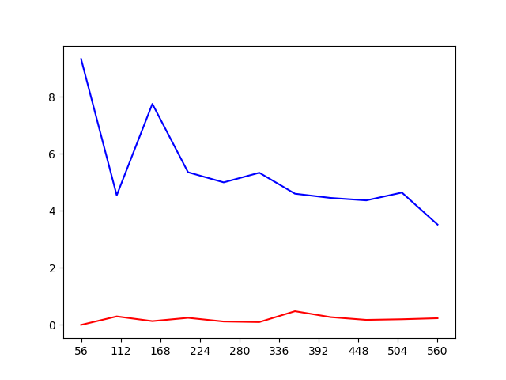
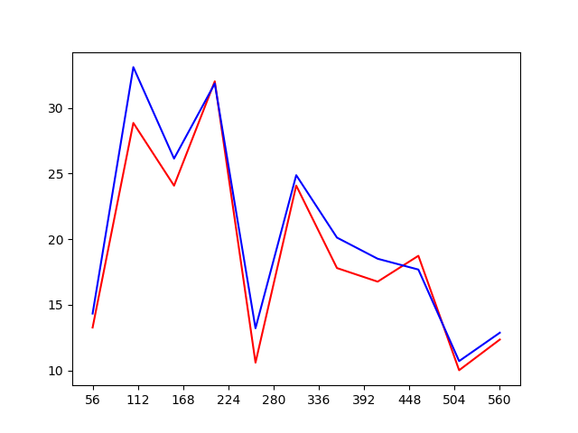
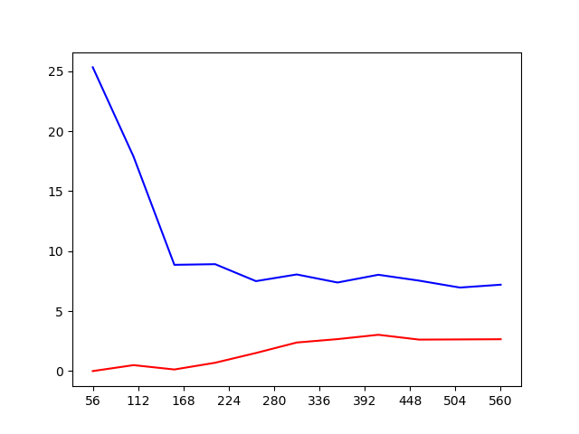
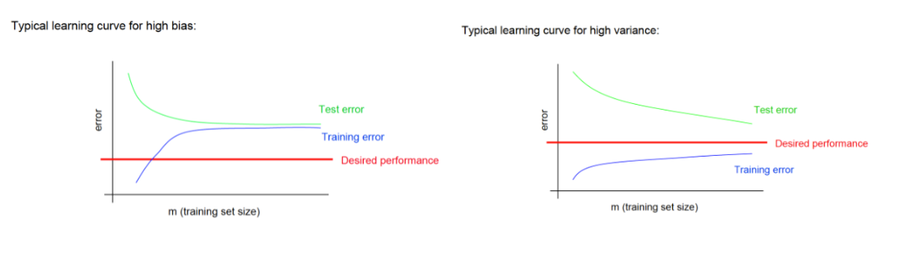

Machine Learning - Scikit Learn
===============================

### Introduction
This project is created for experiencing random forests, neural networks and support vector machine with scikit learn.

### Description
There are 569 data in the _"dataset.txt"_. Details are given below:

* There are 10 iteration. At every iteration, number of used data to train and test is increasing.
* kFold is used. There are 10 folds for each iteration.
* Parameter optimization is done by grid search.
* Curves are drawn with 10 points, one point for each iteration.

### Results
In the following, curves of the training and test error are drawn for the random forests, neural networks and support vector machine.

Random Forests                |  Neural Network               | Support Vector Machine
----------------------------- | ----------------------------- | -----------------------------
 |  | 

In the graphics, x axis represents number of samples and y axis represents error rate. The blue curves are test errors and the red curves are training errors.

### Evaluation
For _"Random Forests"_ and _"Support Vector Machine"_ training error is increasing and test error is decreasing when number of samples is increasing. Their results are as expected. However, the result of _"Neural Networks"_ is not as expected even if I tried with many different parameters. There is two possibilities. First is that i could not find suitable parameters. Second is that _"Neural Networks"_ method is not appropriate for the dataset. I think, the reason for the unexpected curves at the _"Neural Networks"_ is that the method is not appropriate for the dataset.

When gap between the test and training curves are increasing, variance is increasing as seen in the following picture.

Therefore, comparison of variance and bias of the methods are is like below:

> Variance(Support Vector Machine) > Variance(Random Forests) > Variance(Neural Networks) 
> Bias(Support Vector Machine) < Bias(Random Forests) < Bias(Neural Networks)

### License
Copyright 2019 Burak Kuyucu

Licensed under the Apache License, Version 2.0 (the "License");
you may not use this file except in compliance with the License.
You may obtain a copy of the License at

http://www.apache.org/licenses/LICENSE-2.0

Unless required by applicable law or agreed to in writing, software
distributed under the License is distributed on an "AS IS" BASIS,
WITHOUT WARRANTIES OR CONDITIONS OF ANY KIND, either express or implied.
See the License for the specific language governing permissions and
limitations under the License.

